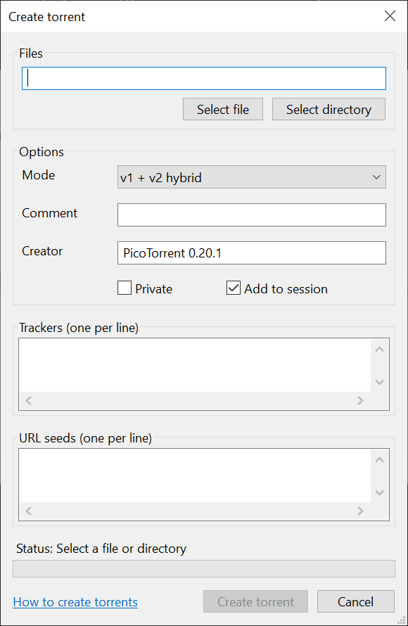

Creating torrents
=================

PicoTorrent has a simple dialog for creating torrents. You can create single-
or multi-file torrents in v1, v2 or hybrid mode.

Options
~~~~~~~

Mode
----

PicoTorrent supports creating torrents in any mode.

 * v1 is the classic torrent file format.
 * v2 is the new BitTorrent 2.0 file format.
 * v1 + v2 hybrid is a mix of the two. It is a v2 torrent which is backwards
   compatible with v1.

BitTorrent 2.0 is still new (as of 2020-09) and pure v2 torrents may not be
supported everywhere. We recommend creating hybrid torrents.

Comment
-------

A free-text comment about the torrent and can be left blank.

Creator
-------

The software used to create the torrent. This can be left blank, but the
default value is the current PicoTorrent version.

Private
-------

Torrents with the `private` flag set ask the client to not use any other sources
than the tracker for peers, and to not use DHT to advertise itself publicly,
only the tracker.

Add to session
--------------

Not a torrent option, but if checked will add the torrent to PicoTorrent and
begin seed it.

Trackers
~~~~~~~~

One tracker per line. This is not strictly required, but most torrents use a
tracker as their main source of peers. The URL should be an `http://`,
`https://` or `udp://` URL to a server running a BitTorrent tracker that
accepts announces for this torrents info hash.

Each tracker is added to its own tier. The tier is the fallback priority of the
tracker. All trackers with tier 0 are tried first (in any order). If all fail,
trackers with tier 1 are tried. If all of those fail, trackers with tier 2 are
tried, and so on.

URL seeds
~~~~~~~~~

One URL seed per line. You can have any number of URL seeds. For a single file
torrent, this should be an HTTP URL, pointing to a file with identical content
as the file of the torrent. For a multi-file torrent, it should point to a
directory containing a directory with the same name as this torrent, and all
the files of the torrent in it.
