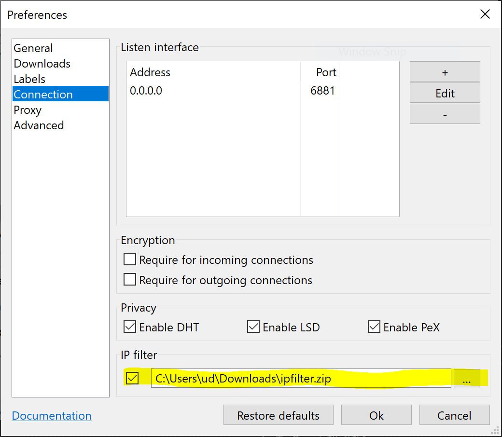

IP Filtering
============

PicoTorrent supports eMule Security IP filters. To enable IP filtering you
need to download the IP filter zip file from https://www.emule-security.org/.

To enable the IP filter, go to the Connections page in Preferences and
click the checkbox as well as selecting an IP filter zip file.

