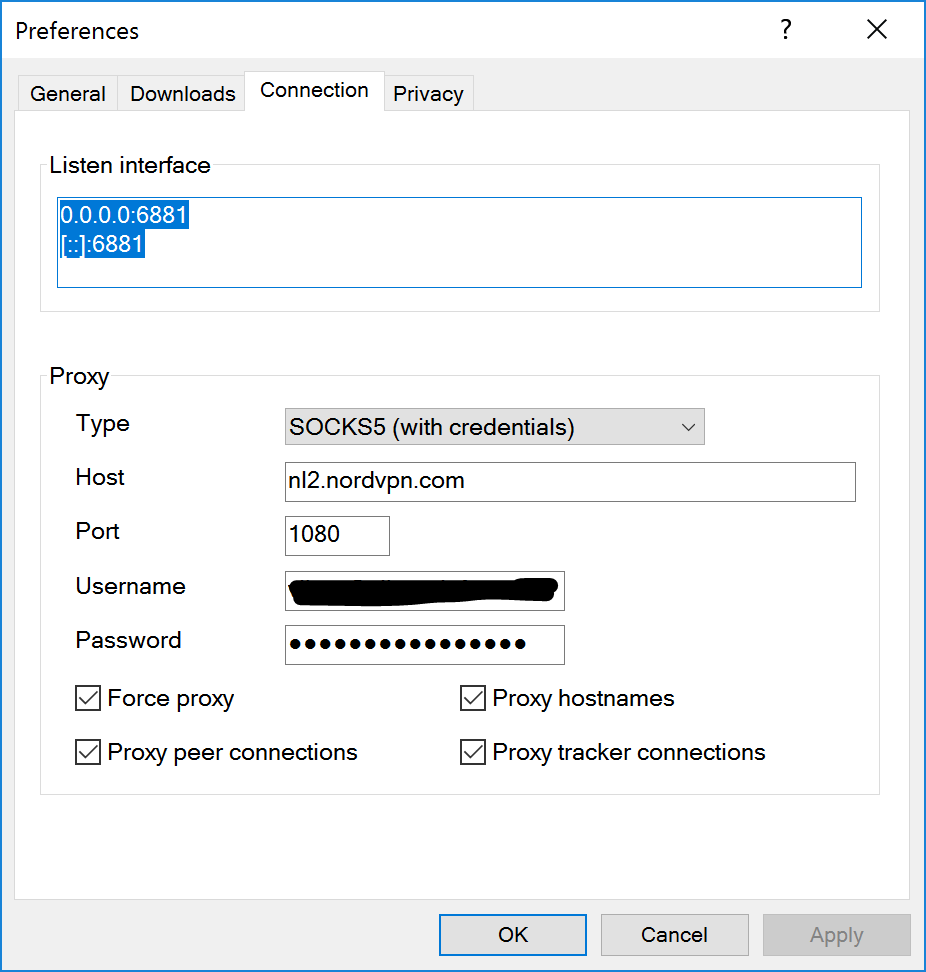

Privacy
=======

To support users with an increased need for privacy, we've made it easy to use
a proxy for BitTorrent traffic. You can also enable *anonymous mode* to further
obfuscate your identity.

Picking a VPN provider
----------------------

There are many VPN providers, and you can even host your own somewhere.
However, for those looking for a quick and easy way of getting started, we've
compiled a single-entry list of the VPN provider we like.

- Mullvad_

.. _Mullvad: https://mullvad.net

Configuring a proxy
-------------------

Configuring a proxy is easy. Just open the *Preferences*, go to the *Connection*
tab and enter your details.

Proxy settings
--------------

- *Force proxy* disables any connections not going through the proxy.
- *Proxy hostnames* will perform hostname lookups through the proxy.
- *Proxy peer connections* will route all peer connections through the proxy.
- *Proxy tracker connections* will route all tracker connections through the
  proxy.
